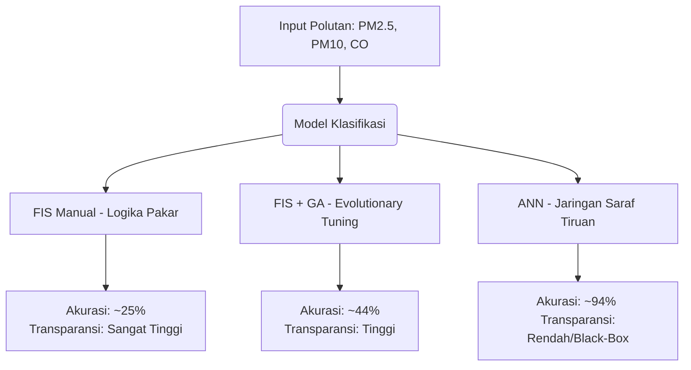

# AirQuality - Sistem Prediksi & Analisis Kualitas Udara (ISPU) DKI Jakarta

Sistem Klasifikasi Kualitas Udara (ISPU) DKI Jakarta adalah sebuah platform analitik interaktif berbasis web yang membandingkan performa tiga paradigma kecerdasan buatan dalam memprediksi status kualitas udara berdasarkan parameter polutan udara utama seperti PM2.5, PM10, dan Karbon Monoksida (CO). 

Aplikasi ini membandingkan pendekatan berbasis pakar (logika fuzzy murni) dengan pendekatan optimasi berbasis data menggunakan Algoritma Genetika dan Jaringan Saraf Tiruan (Deep Learning).

---

## Fitur Utama & Kapabilitas Sistem

Aplikasi ini dirancang dengan antarmuka modern berbasis Streamlit yang kaya visualisasi. Melalui aplikasi ini, Anda dapat melakukan dan mengamati hal-hal berikut:

1. **Simulasi Polutan Dinamis**  
   Menyesuaikan konsentrasi parameter polutan udara secara real-time menggunakan kontrol slider presisi tinggi untuk:
   * **PM2.5 (Partikulat Halus)** dalam satuan $\mu\text{g/m}^3$
   * **PM10 (Partikulat Kasar)** dalam satuan $\mu\text{g/m}^3$
   * **CO (Karbon Monoksida)** dalam satuan ppm

2. **Komparasi 3 Model Kecerdasan Buatan**  
   Membandingkan hasil keputusan klasifikasi kualitas udara (*Sangat Aman*, *Aman*, *Tidak Sehat*, dan *Berbahaya*) dari tiga arsitektur model:
   * **FIS Manual (Pendekatan Pakar)** – Menggunakan aturan logika fuzzy rancangan manusia.
   * **FIS + GA (Evolutionary Tuning)** – Menggunakan Algoritma Genetika untuk mengoptimasi batas keanggotaan fuzzy.
   * **ANN (Neural Optimization)** – Jaringan Saraf Tiruan (*Deep Learning*) yang bertindak sebagai pemeta non-linear dengan akurasi superior.

3. **Visualisasi Fungsi Keanggotaan Fuzzy Interaktif**  
   Menampilkan kurva keanggotaan (*Membership Functions*) segitiga secara langsung untuk melihat derajat keanggotaan (*membership degree*) dari setiap input polutan yang dimasukkan.

4. **Visualisasi Probabilitas ANN**  
   Menampilkan grafik probabilitas distribusi kelas (*softmax output*) menggunakan bagan interaktif dari Plotly ketika memprediksi menggunakan model Jaringan Saraf Tiruan.

---

## Arsitektur Direktori & Struktur Proyek

Proyek ini terorganisasi dengan struktur modular untuk memisahkan logika komputasi AI (*core*) dan antarmuka pengguna (*components*):

```text
AirQualityPredictionSystem/
│
├── air_quality_prediction.ipynb # Notebook eksperimen, analisis data, dan pelatihan model AI
├── app.py                      # Berkas utama (entry point) aplikasi Streamlit
│
├── core/
│   ├── __init__.py
│   └── backend.py              # Logika matematika fuzzy (fuzzifikasi, inferensi, defuzzifikasi) & load model
│
├── components/
│   ├── __init__.py
│   ├── styles.py               # Penyuntikan CSS khusus (modern glassmorphism & neon glow)
│   ├── ui_tabs.py              # Struktur tab Prediksi dan Informasi pada antarmuka pengguna
│   └── visualisasi.py          # Logika pembuatan grafik matplotlib (Fuzzy) & plotly (ANN)
│
├── requirements.txt            # Daftar pustaka & dependensi Python
│
# Bobot Model dan Konfigurasi AI
├── ann_model.h5                # Model ANN tersimpan dalam format legacy H5
├── ann_model.keras             # Model ANN tersimpan dalam format Keras modern
├── model_weights.weights.h5    # Bobot (weights) Jaringan Saraf Tiruan untuk stabilitas versi
├── scaler.pkl                  # StandardScaler untuk normalisasi fitur input ANN
├── label_encoder.pkl           # LabelEncoder untuk memetakan output klasifikasi ANN
├── fis_manual_config.json      # Konfigurasi batas himpunan & aturan fuzzy manual (pakar)
└── fis_ga_config.json          # Konfigurasi batas himpunan fuzzy hasil optimasi Algoritma Genetika
```

---

## Panduan Instalasi & Penggunaan

Ikuti langkah-langkah berikut untuk menjalankan sistem ini di lingkungan lokal Anda:

### Prasyarat
* Python versi `3.9` s.d. `3.11` (sangat direkomendasikan Python 3.10 untuk menjamin kecocokan pustaka TensorFlow dan scikit-fuzzy).

### 1. Kloning Repositori
```bash
git clone https://github.com/username/AirQualityPredictionSystem.git
cd AirQualityPredictionSystem
```

### 2. Pasang Dependensi
Disarankan menggunakan virtual environment (*venv*) untuk menghindari konflik paket:
```bash
# Membuat virtual environment
python -m venv venv

# Mengaktifkan virtual environment (Windows)
.\venv\Scripts\activate

# Mengaktifkan virtual environment (macOS/Linux)
source venv/bin/activate

# Menginstal dependensi
pip install -r requirements.txt
```

### 3. Jalankan Aplikasi
Jalankan server Streamlit menggunakan perintah berikut:
```bash
streamlit run app.py
```
Aplikasi akan secara otomatis terbuka di peramban (browser) Anda pada alamat default `http://localhost:8501`.

---

## Desain & Metodologi Arsitektur Model AI

Sistem ini dirancang untuk membandingkan tiga metode optimasi kecerdasan buatan:



### 1. Fuzzy Inference System (FIS) Manual
* **Konsep**: Menggunakan sistem inferensi fuzzy tipe Mamdani. Aturan inferensi (*rule-base*) dan batas kurva keanggotaan ditentukan sepenuhnya berdasarkan asumsi pakar atau standar teoretis ISPU.
* **Performa**: Memiliki tingkat transparansi logika yang sangat tinggi (dapat dijelaskan), namun memiliki akurasi terendah (~25% pada data uji) karena batas kurva yang statis sulit menangkap variasi pola data riil yang dinamis.

### 2. FIS + Algoritma Genetika (GA)
* **Konsep**: Batas parameter kurva keanggotaan fuzzy dioptimasi secara otomatis menggunakan Algoritma Genetika (`pygad`). GA melakukan pencarian kombinasi nilai parameter kurva (representasi kromosom) yang meminimalkan nilai *Mean Squared Error* (MSE) klasifikasi.
* **Performa**: Berhasil meningkatkan akurasi secara signifikan menjadi ~44% sekaligus mempertahankan keunggulan *explainability* (logika aturan fuzzy yang mudah dipahami manusia).

### 3. Artificial Neural Network (ANN)
* **Konsep**: Menggunakan arsitektur *Multilayer Perceptron* (MLP) dengan struktur lapisan:
  * **Input Layer**: 3 Fitur (PM2.5, PM10, CO)
  * **Hidden Layer 1**: 9 Neuron dengan fungsi aktivasi *Sigmoid* (merepresentasikan lapisan analogi fuzzifikasi)
  * **Hidden Layer 2**: 16 Neuron dengan fungsi aktivasi *ReLU* (merepresentasikan aturan inferensi) yang dikombinasikan dengan *Batch Normalization* dan *Dropout* (0.2) untuk mencegah *overfitting*.
  * **Output Layer**: 4 Neuron dengan fungsi aktivasi *Softmax* untuk menghasilkan distribusi probabilitas dari 4 kelas ISPU.
* **Performa**: Menghasilkan akurasi klasifikasi tertinggi (~94%), sangat kuat dalam memetakan fungsi non-linear yang kompleks, namun sifatnya tertutup (*black-box*).